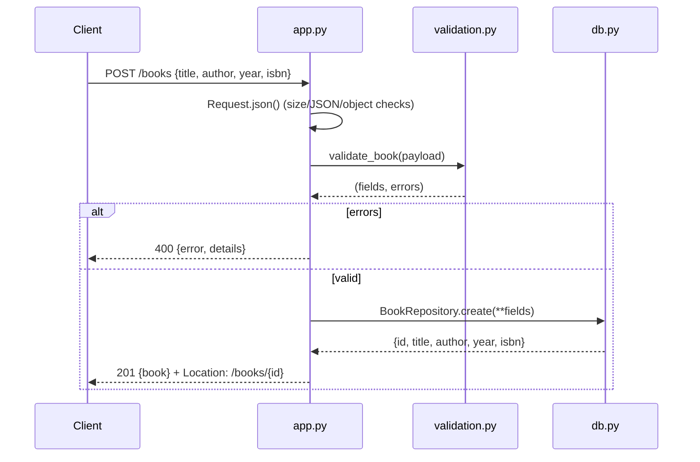

# Flow

A `POST /books` request is dispatched by a small regex router in `BookApp._dispatch`. `Request.json()` enforces the Content-Length / max-body / valid-JSON-object guards before `validate_book` cleans and checks the payload (title and author required; year and isbn optional and typed). On success the `BookRepository` inserts the row under a lock on a shared SQLite connection and the handler returns `201` with the created book and a `Location` header. Errors are raised as `ApiError` and mapped centrally to JSON error responses; any unexpected exception is logged and returned as a generic `500`. No async, no external framework — plain WSGI on the standard library.
