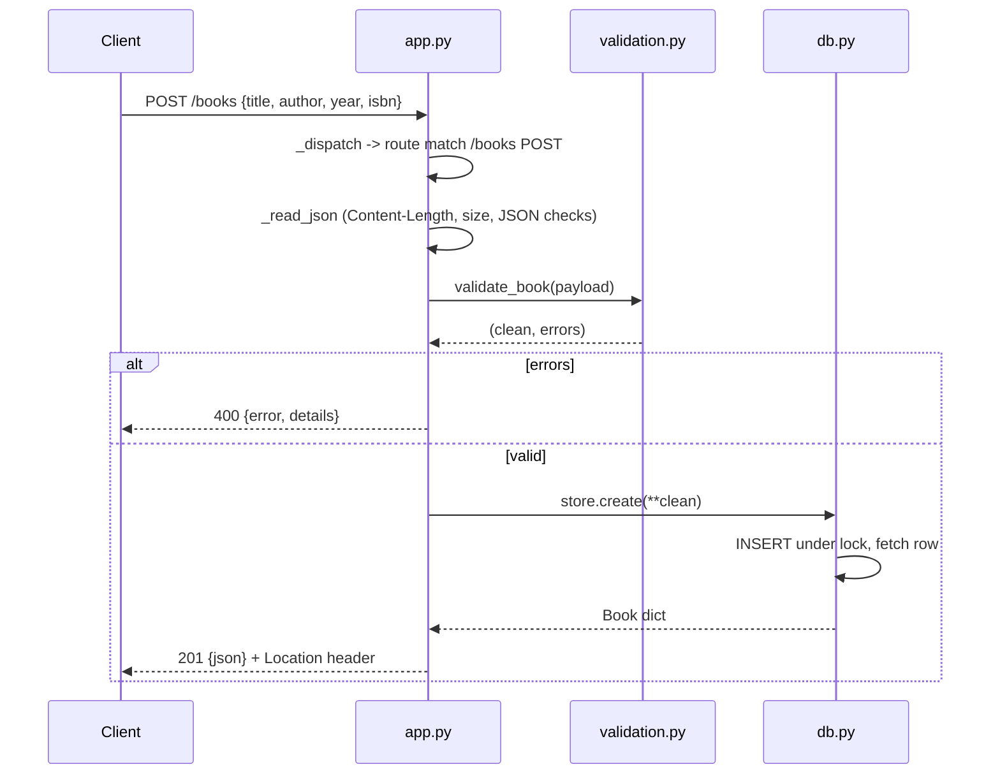

# Flow

A `POST /books` request is dispatched by path/method in `BookApp._dispatch`, its body read and size-checked by `_read_json`, then validated by `validate_book`. On validation errors a 400 with a per-field `details` map is returned. On success `BookStore.create` inserts the row under a threading lock (single shared SQLite connection, `check_same_thread=False`) and the new record is returned as 201 JSON with a `Location` header. All handler exceptions are caught in `__call__`: `ApiError` maps to its status, anything else is logged and returned as 500. Responses are JSON with `Content-Type` and `Content-Length` set; 204 responses send an empty body. Author filtering on list uses a registered `casefold` SQL function for non-ASCII case-insensitivity; out-of-range ids are rejected before binding.
