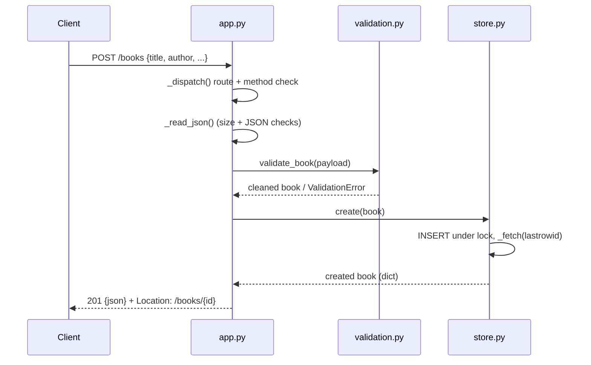

# Flow

A `POST /books` request is routed by `BookApp._dispatch`, which strips a trailing slash, matches `/books`, and enforces the allowed methods. The body is read with a Content-Length and 1 MiB size guard and decoded as JSON, then passed to `validate_book`, which returns cleaned fields or raises `ValidationError` (surfaced as `400` with a per-field `details` map). On success, `BookStore.create` inserts the row under a threading lock and re-fetches it, and the handler responds `201` with the JSON book and a `Location` header. Every handler is wrapped by `__call__`, which converts `HTTPError` into the intended status and any other exception into a logged `500`. Notable: the app is stdlib-only (`wsgiref` + `sqlite3`, no framework); persistence uses a single shared connection guarded by a lock rather than a pool; PUT is a full replace (omitted optional fields are cleared); and out-of-range or non-numeric ids short-circuit to `404` before touching the DB.
