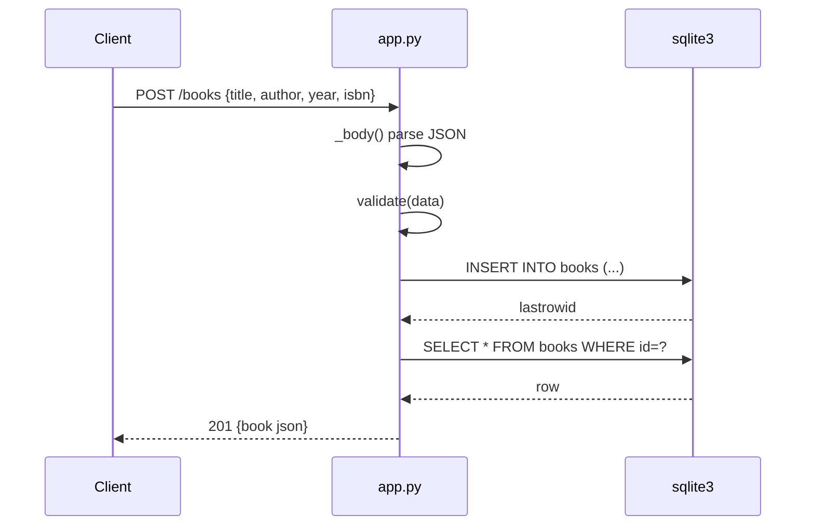

# Flow

A `POST /books` reads the request body, parses it as JSON, and runs `validate()`,
which requires non-empty string `title`/`author` and type-checks optional `year`
(int) and `isbn` (str); on failure it returns `400 {"error": ...}`. On success it
`INSERT`s into the shared SQLite connection (opened once with
`check_same_thread=False` and served by a `ThreadingHTTPServer`), re-reads the
inserted row, and returns it as `201`. All routes are dispatched through a single
`_route()` method rather than per-verb handlers. No pagination; the `?author=`
filter is exact-match.
