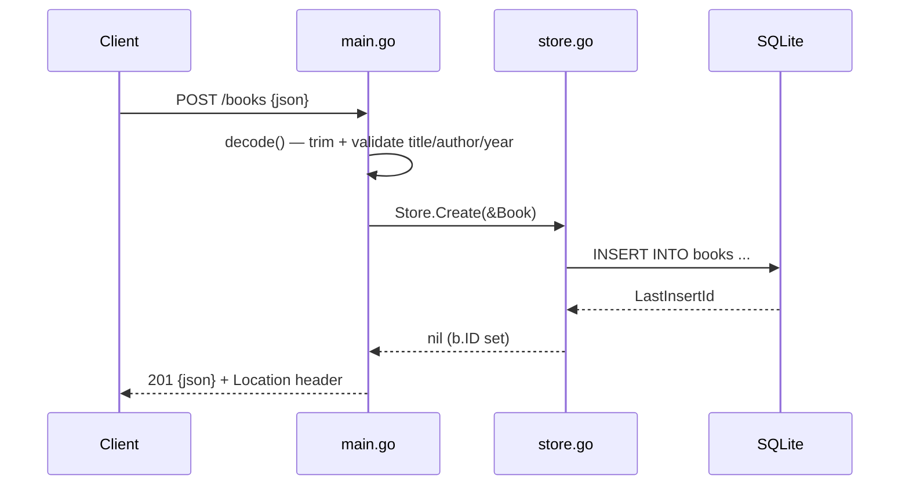

# Flow

A `POST /books` request is decoded by `decode()`, which trims whitespace and rejects a missing title, missing author, or negative year with `400`. On success `handlers.create` calls `Store.Create`, which inserts a row and populates `b.ID` from `LastInsertId`, then responds `201` with the JSON book and a `Location` header. Errors from the store are logged and returned as `500`. The other routes follow the same handler→store→SQLite pattern; `Get/Update/Delete` map `sql.ErrNoRows` to `404`.
