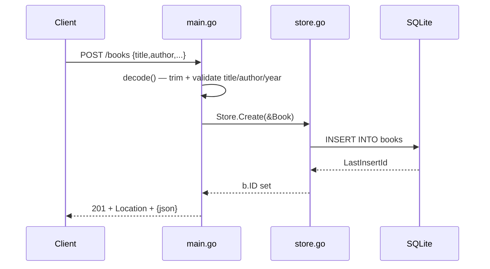

# Flow

A `POST /books` request is decoded and validated by `decode()` (body capped at 1 MiB via `MaxBytesReader`; empty title or author, or negative year, → 400). The handler zeroes any client-supplied ID, calls `Store.Create`, which inserts into SQLite and back-fills the generated `ID`, then responds 201 with a `Location` header and the JSON book. Not-found errors from the store are mapped to 404 via `server.fail`; other store errors log and return 500. Routing uses Go 1.22+ method-pattern `ServeMux` (`GET /books/{id}` etc.) with `r.PathValue("id")`.
