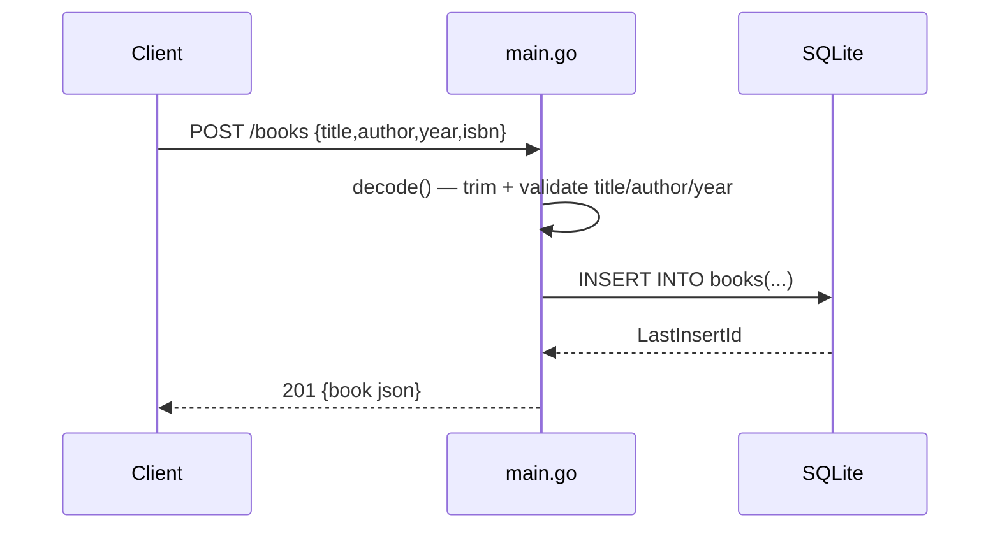

# Flow

A `POST /books` request is decoded by `decode()`, which trims and validates that `title` and `author` are non-empty and `year` is non-negative (400 otherwise, with a JSON `{"error":...}` body). Valid input is inserted into the SQLite `books` table via a parameterized statement, the generated id is read from `LastInsertId`, and the full book is returned as JSON with 201. All handlers share the same `*sql.DB` (opened with `SetMaxOpenConns(1)` for consistency); errors map to appropriate 400/404/500 codes. No pagination on the list route; the `?author=` filter is an exact SQL match.
