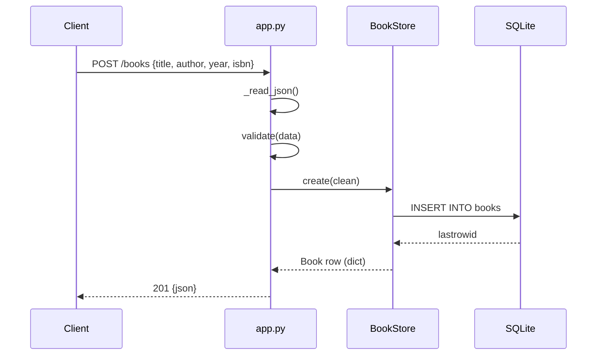

# Flow

A `POST /books` reads the request body as JSON, validates that `title` and `author` are non-empty strings (and that `year`/`isbn` have the right types), then inserts a row via `BookStore.create` under a `threading.Lock`, and returns the persisted book with `201`. Validation failures short-circuit to `400` with an `error`/`details` payload before any DB access. The store uses a single shared SQLite connection (`check_same_thread=False`) guarded by a lock, so writes are serialized across the threading HTTP server.
