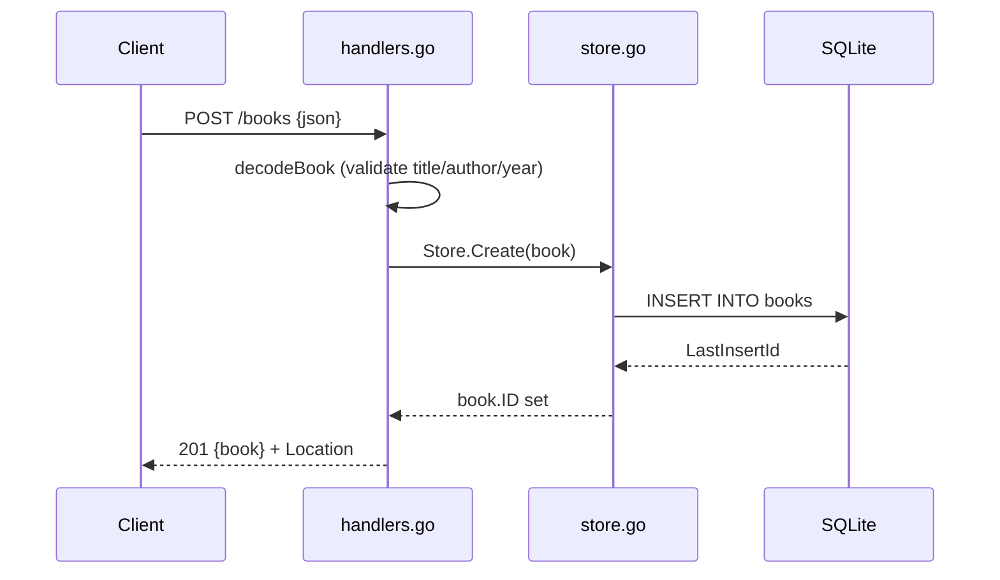

# Flow

A `POST /books` request is decoded and validated by `decodeBook`, which uses a
strict `json.Decoder` (`DisallowUnknownFields`, `MaxBytesReader`, trailing-data
check) and rejects blank title/author or a negative year with a 400. On success
`Store.Create` inserts the row, the generated id is written back onto the book,
and the handler returns 201 with a `Location` header. Reads/updates/deletes
follow the same handler→store→SQLite path, mapping `ErrNotFound` to 404 and bad
ids to 400. No pagination; `?author=` is an exact-match filter.
