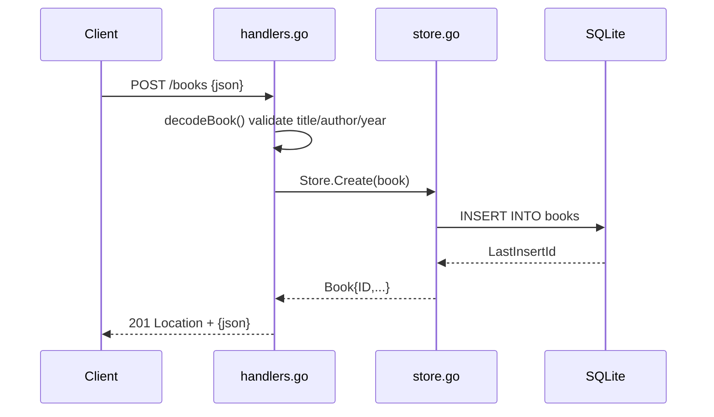

# Flow

A `POST /books` request is size-limited (`MaxBytesReader`, 1 MiB), strictly JSON-decoded (rejects trailing tokens), and validated: `title` and `author` must be non-blank after trimming and `year` must be 0–9999, else 400. On success the book is inserted into SQLite and returned as 201 with a `Location` header. Reads (`GET /books`) support an exact case-insensitive `?author=` filter; missing ids return 404. Validation and error handling are present throughout; the store pins `MaxOpenConns(1)` to keep `:memory:` coherent and avoid write-lock contention.
