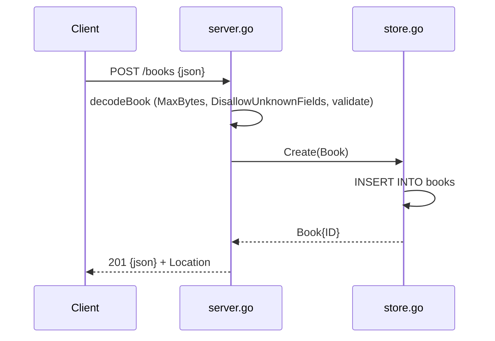

# Flow

A `POST /books` request is decoded through a 1 MiB-capped reader with `DisallowUnknownFields` and a trailing-data check, then validated (title/author required, year range, isbn length). Valid input is inserted via `store.Create`, which returns the row with its autoincrement `ID`; the handler responds `201 Created` with a `Location` header and the JSON body. Validation failures return `422` with a per-field error map; malformed/unknown-field bodies return `400`. Notable: full-replacement `PUT` semantics, graceful server shutdown on SIGINT/SIGTERM, and a single-connection SQLite pool to keep `:memory:` coherent.
