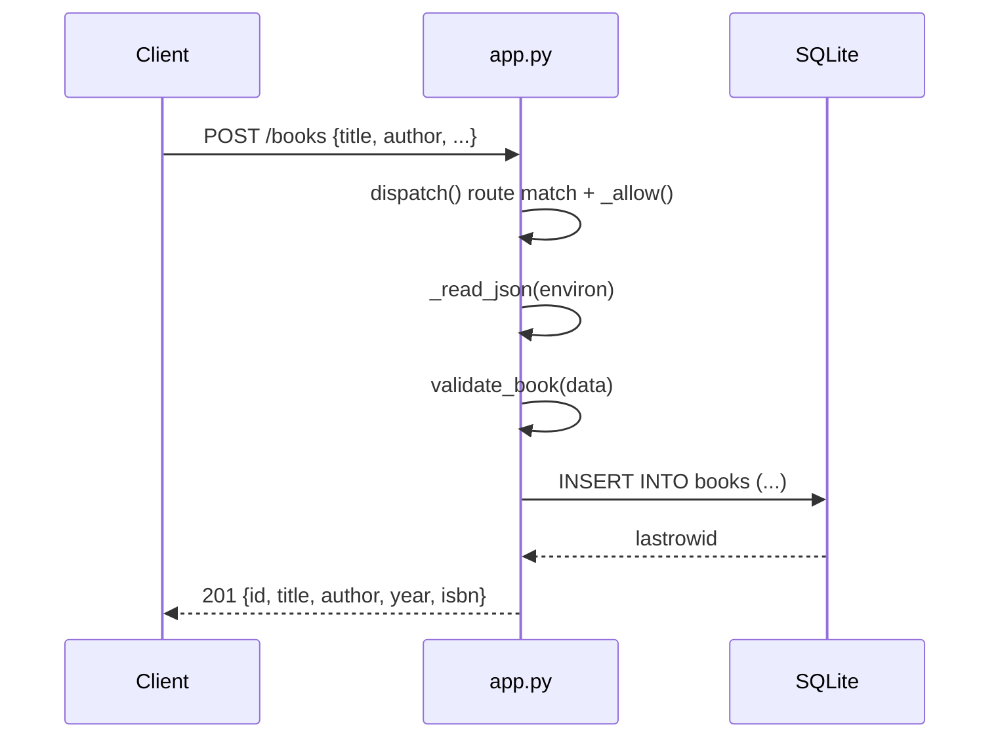

# Flow

A request is dispatched by `BookApp.dispatch`, which matches the path, enforces the allowed methods (`405` otherwise), parses and size-limits the JSON body (`400`/`413`), and validates required fields via `validate_book` (`422` on failure). Each handler opens its own short-lived `sqlite3` connection with `row_factory = sqlite3.Row`, runs a single parameterized statement inside a `with conn` transaction, and closes the connection in a `finally`. Errors propagate as `HTTPError` and are rendered to JSON by the WSGI `__call__` wrapper, which also catches unexpected exceptions as `500`. No third-party dependencies; the server is a threaded `wsgiref` server.
