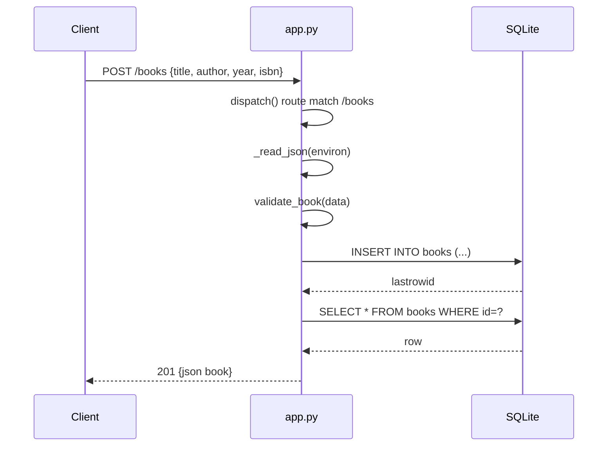

# Flow

A `POST /books` request is matched by `dispatch()` against the collection route regex, its body read and size-capped by `_read_json()`, then validated by `validate_book()` (title/author required non-empty strings; year int-or-null; isbn str-or-null). On success it opens a fresh SQLite connection, inserts the row inside a transaction, re-fetches it, and returns `201` with the created book as JSON. Validation failures raise `HTTPError(400)` with a per-field `details` map; the top-level `__call__` catches all `HTTPError`s and any unexpected exception (→ `500`). Each request opens and closes its own connection — no shared state, and persistence is verified across app instances.
