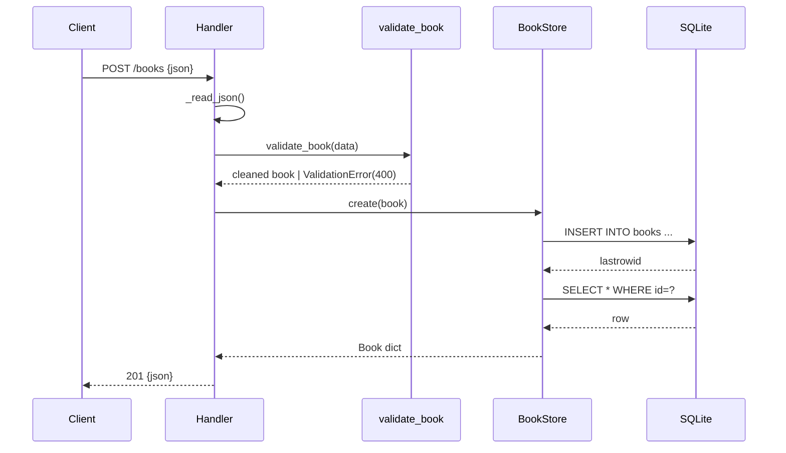

# Flow

A `POST /books` reads and JSON-parses the request body, runs `validate_book` (title/author required non-empty strings; year optional int in range; isbn optional string), inserts the row into SQLite via a fresh connection per operation, re-reads the created row, and returns it with a 201. Validation failures raise `ValidationError`, caught in `_dispatch` and returned as `400 {"error":"validation failed","details":{...}}`. Each `BookStore` method opens and closes its own connection; the server is a `ThreadingHTTPServer` using `HTTP/1.1` with explicit `Content-Length`.
