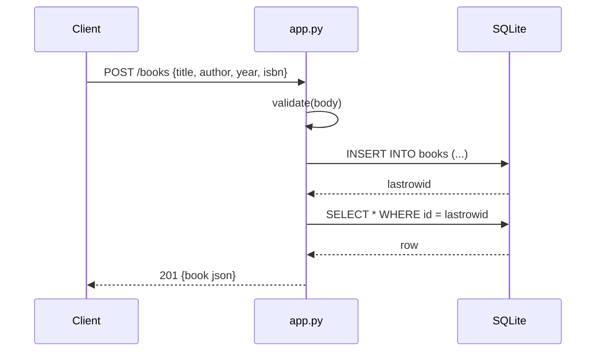

# Flow

A `POST /books` request is validated (`title` and `author` must be non-empty strings; `year` must be an int if present; `isbn` a string if present) before a new SQLite connection inserts the row and re-selects it to return the persisted record with its assigned `id`. Each handler opens its own short-lived `sqlite3` connection via the `db()` closure. Validation errors return `400 {error}`; missing books return `404 {error}`. No pagination; `?author=` filters via an exact-match SQL `WHERE`.
