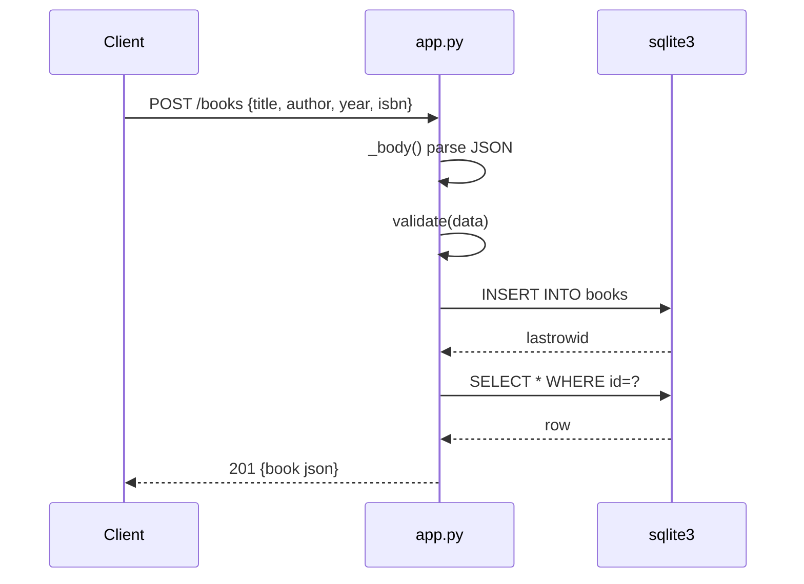

# Flow

A `POST /books` reads the Content-Length-bounded body, JSON-decodes it, runs `validate()` (title and author required non-empty strings; year must be int; isbn must be str), inserts the row into the shared SQLite connection, and returns the freshly-selected row as 201 JSON. Invalid bodies short-circuit to 400 with `{error}`. The single connection is opened with `check_same_thread=False` and shared across the `ThreadingHTTPServer` worker threads — SQLite serializes the writes internally.
