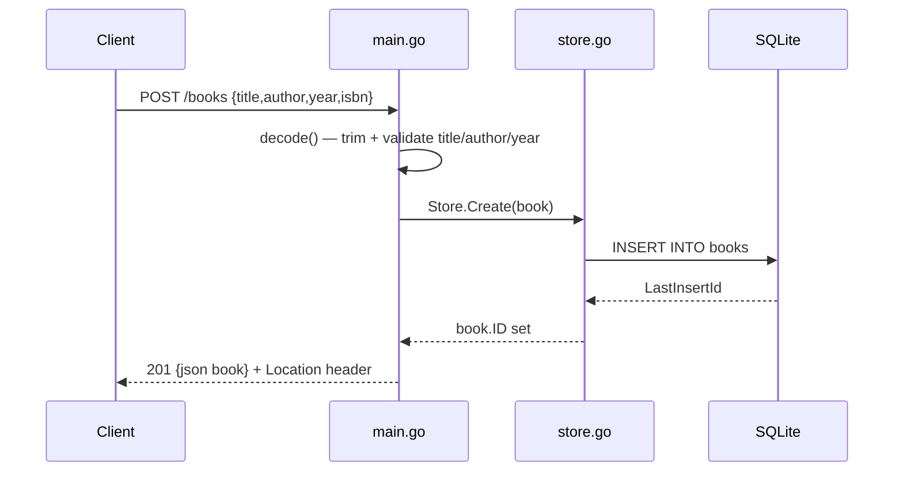

# Flow

A `POST /books` request is decoded by `main.go:decode`, which caps the body at 1 MiB, trims `title`/`author`, and rejects empty title, empty author, or negative year with `400`. On success the validated `Book` is inserted via `store.go:Store.Create`, which fills `ID` from `LastInsertId`, and the handler returns `201` with the JSON book and a `Location` header. Read/update/delete paths parse the `{id}` path value (`400` on non-numeric/≤0) and map the store's `errNotFound` sentinel to `404`. Persistence is real SQLite (pure-Go `modernc.org/sqlite`); `SetMaxOpenConns(1)` serializes access and keeps `:memory:` DBs consistent in tests.
