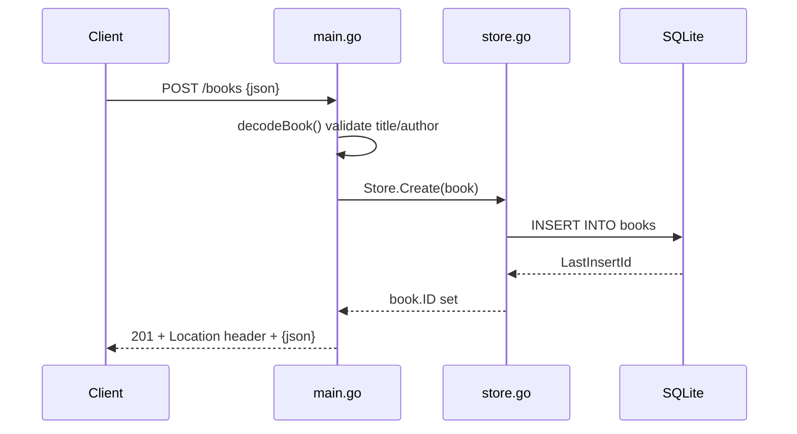

# Flow

A `POST /books` request is decoded and validated in `decodeBook` (title and author required, both trimmed; negative year rejected; body capped at 1 MiB via `MaxBytesReader`). On success `Store.Create` inserts the row into SQLite (pure-Go `modernc.org/sqlite`) and back-fills the generated `ID`; the handler responds 201 with a `Location` header and the JSON book. Not-found conditions propagate through a sentinel `errNotFound` mapped to 404 in `fail()`; other errors log and return 500. Routing uses Go 1.22 method-pattern `ServeMux` (`GET /books/{id}` etc.), so no third-party router is needed.
