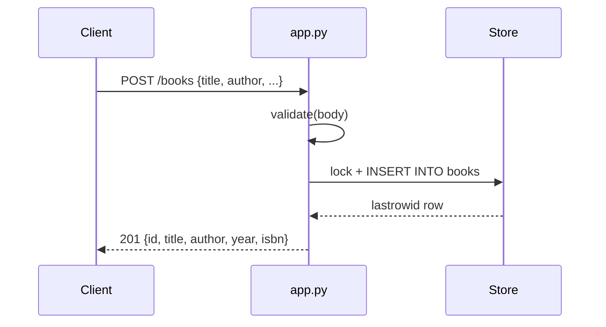

# Flow

A `POST /books` request is dispatched by `app()` (WSGI entry) to `handle()`, which parses the JSON body, calls `validate()` to enforce that `title` and `author` are non-empty strings (raising `ValidationError` → 400 otherwise), then acquires the `Store` thread lock and inserts the row into SQLite. The just-inserted row is re-selected and serialized as JSON with a 201 status. All DB access is guarded by a single `threading.Lock` over one shared connection (`check_same_thread=False`), since `wsgiref` serves requests on worker threads.
