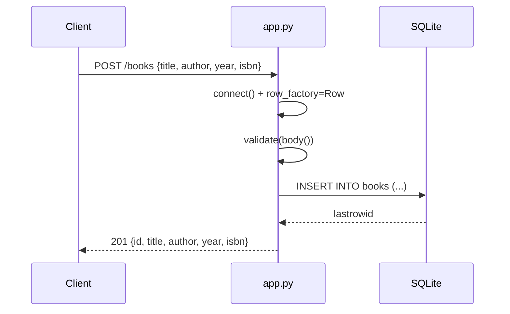

# Flow

A request enters the WSGI `app`, which opens a fresh SQLite connection per request (closed in a `finally`, except for `:memory:` which reuses one shared connection). `handle()` dispatches on method + path: `/health`, exact `/books`, and a regex `^/books/(\d+)$`. For POST it reads the body lazily via a `body()` thunk, runs `validate()` (title/author required non-empty strings; year must be int; isbn must be str), inserts, and returns 201 with the created record. `HTTPError` is caught centrally and rendered as `{"error": msg}` with the matching status. Notable: per-request connection open/close (not pooled), full-replacement PUT semantics (PUT re-validates title/author), and no pagination on list.
