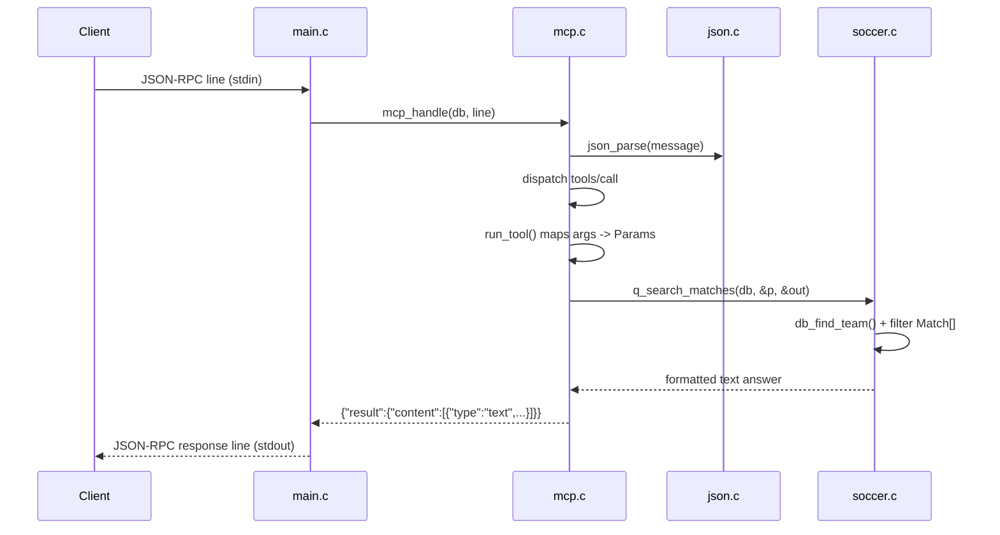

# Flow

At startup `main()` calls `db_load()`, which reads the six CSVs, normalizes and de-duplicates matches, and builds a FIFA player index sorted by overall rating. Each stdin line is parsed as JSON-RPC by `mcp_handle`; a `tools/call` request resolves the named tool, `run_tool` maps its JSON arguments onto the shared `Params` struct (validating required args and types), and the corresponding `q_*` function walks the in-memory data and writes a human-readable text answer. The answer is wrapped as MCP `content` and written back to stdout, with all logging kept on stderr so the protocol stream stays clean. Team names are matched loosely (accents and state suffixes optional). Errors are reported as tool results with `isError:true` rather than transport-level failures.
