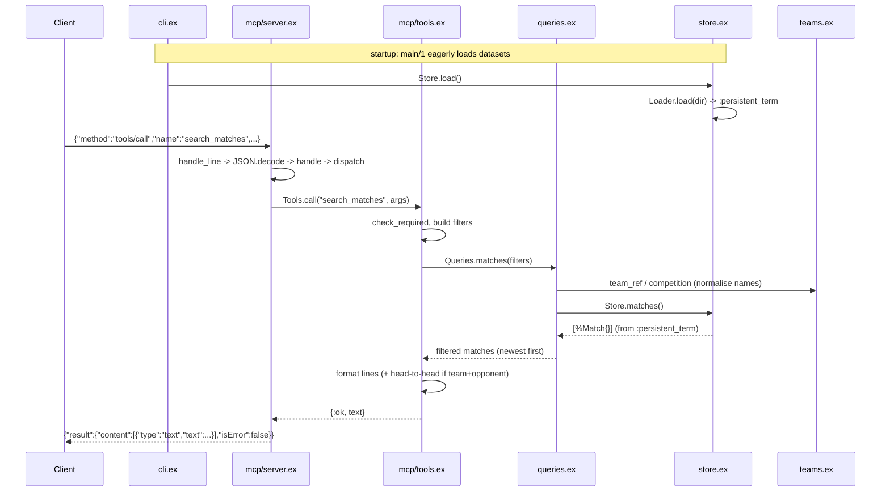

# Flow

The most representative flow is an MCP `tools/call` for `search_matches` (the primary
match-query feature), served from data pre-loaded at startup.

A `tools/call` line arrives on stdin; `server.ex:run/2` reads it line-by-line,
`handle_line/1` JSON-decodes it, and `handle/1` → `dispatch/3` routes `tools/call` to
`Tools.call/2`. The tool checks required arguments, atomises the string-keyed args into
a filter map, and calls `Queries.matches/1`. That resolves the team and competition
names through `Teams`/`Text` (accent folding, aliases, state disambiguation), then
linearly filters the in-memory match list served from `:persistent_term` via `Store`,
returning matches sorted newest-first. When both team and opponent are present it also
computes a head-to-head summary. The result is rendered as a plain-text block and
wrapped in a JSON-RPC result written back to stdout.

Notable characteristics: data is loaded eagerly at startup and held in
`:persistent_term` (read without copying); all queries are pure in-memory linear scans
over the merged match list with no index, database, or pagination beyond a `limit`.
The MCP layer (`handle/1`) is a pure function from request to response, keeping the
protocol testable without I/O. Tool output is human-readable text rather than
structured JSON. Logging is routed to stderr because stdout carries the JSON-RPC
stream. `tools/call` handlers are wrapped in a rescue that converts exceptions into a
-32603 internal error rather than crashing the loop. No authentication and no network
calls — the optional external APIs named in the spec are not used.
