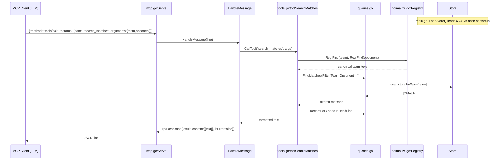

# Flow

The dominant flow is an MCP `tools/call` for `search_matches` — the first thing
an LLM client hits when asked a question like "Show me all Flamengo vs Fluminense
matches". Data is loaded once at startup; each call is a synchronous in-memory
query.

Narration: at startup `main.go` resolves the data directory and calls
`LoadStore`, which reads all six CSVs, normalises team names into canonical
`base|state` keys, de-duplicates overlapping match sources, and indexes matches
by team. `Serve` then reads newline-delimited JSON-RPC requests in a loop. For a
`tools/call`, `HandleMessage` dispatches to `CallTool`, which looks the tool up by
name and runs its handler. `toolSearchMatches` resolves the team/opponent strings
to canonical keys via the fuzzy `Registry.Find`, builds a `Filter`, calls
`FindMatches` (which scans the pre-built `byTeam` index), formats a newest-first
match list, and — when an opponent is given — appends a head-to-head record. The
handler returns plain text wrapped as MCP text content.

Deviations from common patterns:
- No database or network at request time; all queries run against in-memory
  slices/maps built once at load.
- No pagination; `limit` truncates output with a "... N more" note.
- Errors from a tool handler are not JSON-RPC errors — they are returned as
  successful responses with `isError:true` and an "Error: ..." text body.
- The server is effectively single-threaded per request (a mutex guards only the
  response encoder); no concurrency across requests.
- No authentication and no input size limits; malformed JSON yields a `-32700`
  parse-error response.
