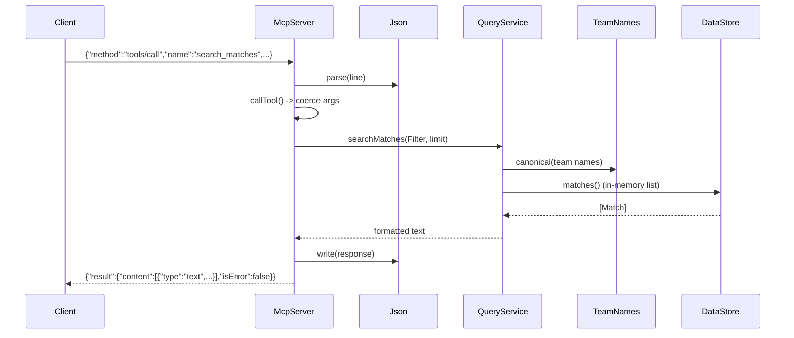

# Flow

At startup `McpServer.main` calls `DataStore.load`, which reads the six CSVs via `Csv`,
canonicalizes every team name through `TeamNames`, merges fixtures that appear in multiple
source files into single `Match` records, and holds everything in memory. The server then
loops reading one JSON-RPC line at a time from stdin. For a `tools/call`, it parses the
line with `Json`, coerces the arguments (lenient string/number/date/boolean handling),
dispatches to the matching `QueryService` method, and returns the method's plain-text
result wrapped in MCP `content`. Queries run entirely over the in-memory lists — no
database, no network, no pagination beyond a `limit` argument. Bad tool input is caught
and returned in-band with `isError: true` rather than as a JSON-RPC error, so the calling
model can self-correct; malformed JSON or unknown methods return standard JSON-RPC error
codes.
