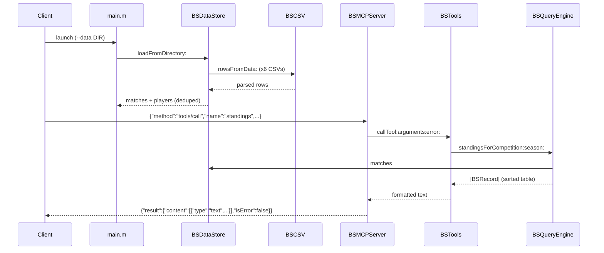

# Flow

On start, `main.m` resolves the data directory and `BSDataStore` loads all six CSVs via `BSCSV`, normalising team names/dates and merging fixtures that appear in multiple files (duplicates counted). The `BSMCPServer` read loop parses each stdin line as JSON-RPC, dispatches `tools/call` to `BSTools`, which validates arguments, delegates the computation to `BSQueryEngine` (pure functions over the in-memory store), and returns a human-readable text block. Standings, records, aggregates and rankings are all computed from raw results rather than stored — e.g. `standingsForCompetition:season:` builds a table, applies 3-points-per-win and Brasileirão tie-breakers, and filters stray mislabelled fixtures. Errors (unknown team/competition, bad date, missing required arg) are surfaced in-band with `isError:true`, not as protocol errors.
