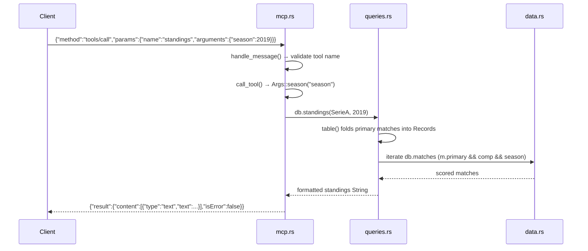

# Flow

A `tools/call` for `standings` is parsed in `mcp.rs:handle_message`, which checks the tool exists then dispatches through `call_tool`. Arguments are coerced via the `Args` helper (`season` parsed to `u16`, defaulting competition to Série A). `Database::standings` calls `table()`, which folds every match flagged `primary` for that competition/season into per-team `Record`s (3 pts/win, tie-break by wins → goal difference → goals for), detects a complete double round-robin to label champion/relegation, and returns a formatted text block. The MCP layer wraps it as JSON-RPC content with `isError:false`. Data is loaded once at startup by `Database::load`, which reads all six CSVs, merges stateless team spellings, and picks one primary source per (competition, season) so overlapping files never double-count. Notable: query results are human-readable text (not structured JSON) by design for LLM consumption; errors are returned as `isError:true` content rather than JSON-RPC errors so the model sees the message.
