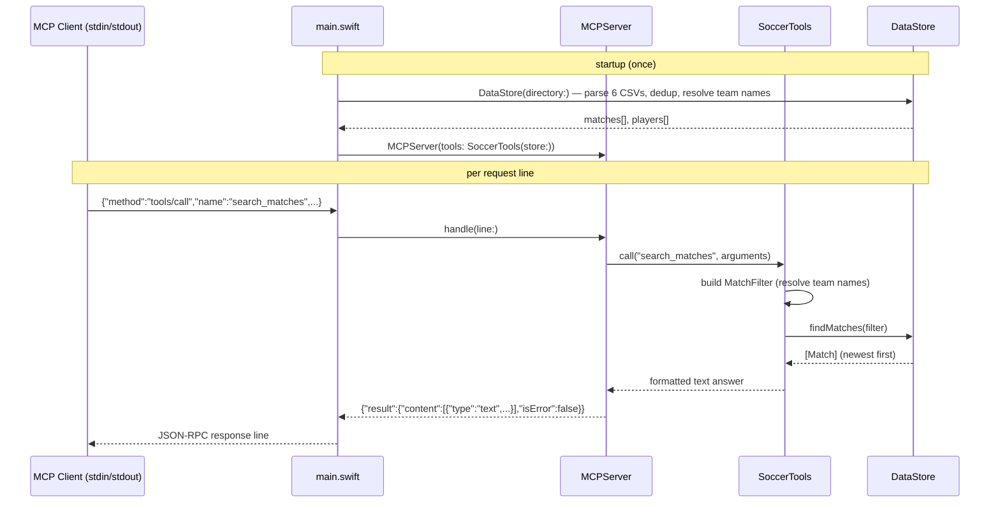

# Flow

At startup `main.swift` locates `data/kaggle` (explicit flag, env var, or by walking up the directory tree), then `DataStore` parses all six CSV files with the custom byte-level `CSV` reader, normalises every team name to a canonical key via `TeamNames`/`TeamResolver`, merges fixtures that appear in more than one file within two days, and holds the results in memory. The process then loops over stdin lines: each JSON-RPC message goes to `MCPServer.handle`, which for a `tools/call` dispatches to `SoccerTools.call`. That resolves the loosely-typed arguments into a typed `MatchFilter` (or `PlayerFilter`), runs the query against the in-memory `DataStore`, and formats a human-readable text block that is wrapped in an MCP `content` result and printed to stdout.

Notable characteristics:
- Fully synchronous and single-threaded; the whole dataset is loaded eagerly into memory once, so all queries are in-memory `filter`/`sort` scans (no index, no pagination beyond a `limit` cap of 500).
- Tool-level errors are caught and returned as an MCP result with `isError: true` rather than a JSON-RPC error, so the model sees the message; malformed JSON and protocol violations still return JSON-RPC error codes.
- Argument parsing is defensive: strings are trimmed, ints accept numeric strings or whole doubles, and unknown teams/competitions/metrics raise descriptive `ToolError`s.
- Team-name handling is the load-bearing complexity: accent folding, affix/alias stripping, and state-suffix disambiguation (e.g. Botafogo-RJ vs Botafogo-SP) so varied spellings across datasets resolve to one key.
