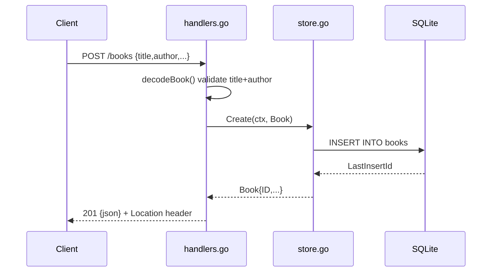

# Flow

A `POST /books` request is decoded by `decodeBook()`, which reads at most 1 MiB,
rejects malformed or multi-object bodies, trims strings, and requires non-empty
`title` and `author` (else 400 with a per-field `details` map). The validated
`Book` is inserted by `store.Create` via a parameterised query; the assigned ID
is returned and the handler responds 201 with a `Location: /books/{id}` header.
Store errors are mapped through `writeStoreError` (`ErrNotFound` → 404, else 500
with details hidden). The store uses a single connection (`SetMaxOpenConns(1)`)
so writes serialise and `:memory:` databases stay consistent.
