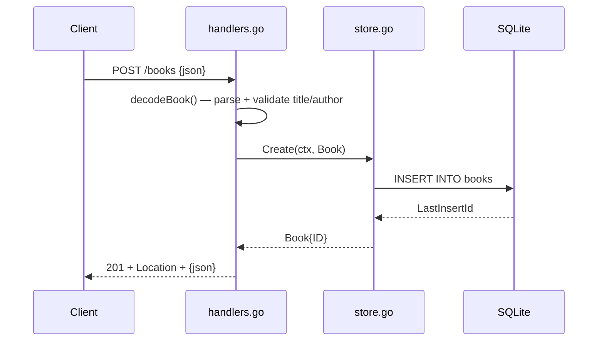

# Flow

A `POST /books` request is size-capped (`http.MaxBytesReader`, 1 MiB) and
decoded strictly (unknown-trailing-data rejected). `decodeBook` trims string
fields and rejects a blank `title`/`author` or negative `year` with a 400 that
lists the offending fields. On success the handler calls `Store.Create`, which
runs a parameterized `INSERT` (SQL-injection-safe) and returns the row with its
assigned ID; the handler responds 201 with a `Location` header. Store errors map
to 404 (`ErrNotFound`) or a logged 500. The DB uses a single connection
(`SetMaxOpenConns(1)`) to serialize writes.
