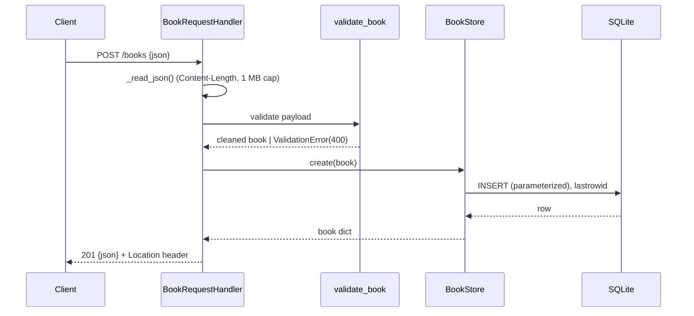

# Flow

A `POST /books` request is dispatched by verb (`do_POST` → `_dispatch` → `_route`), which reads the body with a `Content-Length` check and 1 MB cap, runs `validate_book()` (title/author required and non-blank, `year` must be an int, `isbn` must be a string), and inserts via a single lock-guarded SQLite connection using parameterized SQL. Success returns `201` with the created book and a `Location` header. Every handler path is wrapped so `ValidationError` becomes a `400` with per-field details and any other exception becomes a `500`, keeping responses JSON. Storage uses one shared connection guarded by a `threading.Lock`, which lets `:memory:` databases work under the threaded server.
