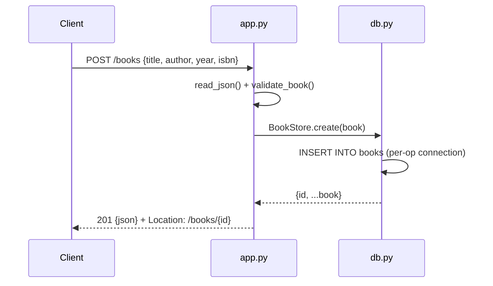

# Flow

A `POST /books` request is read and size-limited by `read_json()` (rejecting bodies over 1 MB with 413 and malformed JSON with 400), validated by `validate_book()` (title/author required non-empty strings, year an optional int, isbn an optional string), then persisted by `BookStore.create()`, which opens a fresh SQLite connection per operation and returns the row with its generated id. A unique-ISBN collision surfaces as `DuplicateISBN` → 409. Errors are funneled through a single `HTTPError` path in `BookAPI.__call__`, which also catches unexpected exceptions and returns a 500 without leaking internals. Notable: standard-library-only (wsgiref + sqlite3, no framework), threaded server, parameterized SQL throughout.
