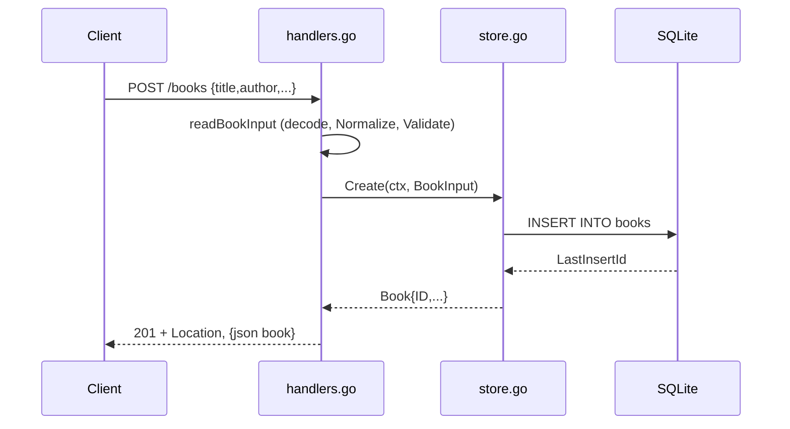

# Flow

A `POST /books` request is decoded with a 1 MiB body cap and strict
single-object enforcement, whitespace-trimmed, then validated (title and author
required, year non-negative). Invalid input returns 400 with a per-field
`fields` map before any DB access. Valid input is inserted via a parameterized
statement and the created book is returned as 201 JSON with a `Location`
header. Store failures map to 404 (`ErrNotFound`) or 500; all responses are
`application/json`. Handlers use `r.Context()` throughout and the server does a
graceful shutdown on SIGINT/SIGTERM.
