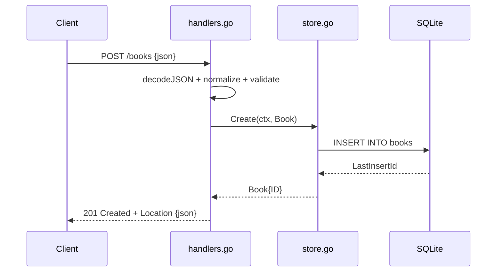

# Flow

A `POST /books` request is decoded with a 1 MiB cap by `decodeJSON`, which rejects
malformed JSON, wrong field types, trailing data, and empty bodies with `400`/`413`.
The input is trimmed (`normalize`) and validated (`validate`) — `title` and `author`
are required, with length and year-range bounds. On success `store.Create` inserts a
row and returns the book with its assigned ID; the handler responds `201` with a
`Location` header. Errors from the store are mapped to HTTP status by `storeError`
(`ErrNotFound` → 404, otherwise a logged generic 500). Notable: full request
validation, graceful shutdown, structured request logging, and a pure-Go SQLite driver
(no cgo). `PUT` is a full replacement rather than a partial patch.
