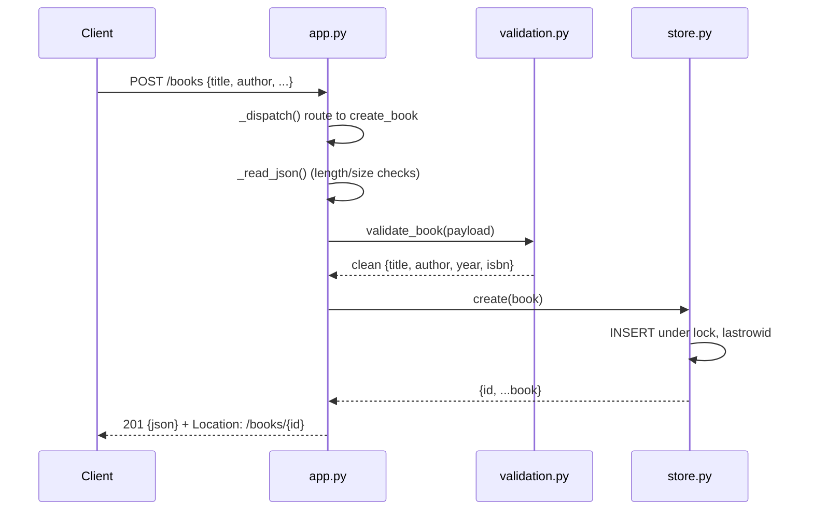

# Flow

A `POST /books` request is routed by `BookAPI._dispatch` on the normalized path, which reads and JSON-parses the body (rejecting bodies over 1 MiB with 413 and malformed JSON with 400). The payload passes through `validate_book`, which trims strings, enforces that `title`/`author` are required non-empty storable strings, range-checks `year`, and drops unknown fields — raising `ValidationError` (mapped to a 400 with a per-field `details` map) on any failure. The clean dict is inserted by `BookStore.create` under a single shared, lock-guarded SQLite connection, and the new row (with its `id`) is returned as 201 JSON with a `Location` header.

Notable characteristics: input validation is thorough (surrogate/UTF-8 checks, bool-vs-int year, oversized-ID guard); SQL uses parameterized queries throughout; one shared connection is serialized by a `threading.Lock` rather than per-request connections (keeps `:memory:` usable, limits write concurrency); PUT is a full-object replace, not a partial patch; unexpected exceptions are caught and returned as a generic JSON 500; `HEAD` and trailing-slash requests are handled explicitly.
