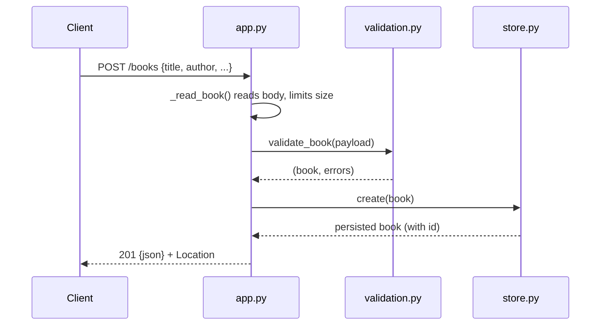

# Flow

A request to `POST /books` is dispatched by regex/path matching in `BookAPI._dispatch`. `_read_book` enforces a `Content-Length` cap (1 MiB), parses JSON, and runs `validate_book`, which requires non-blank `title` and `author` and type-checks `year`/`isbn`; validation failure raises `APIError(400)` with per-field details. On success `BookStore.create` inserts via a parameterised query under a lock on a single shared connection, and the new row is returned as `201` JSON with a `Location` header. All handlers funnel exceptions through a single `APIError` path; unexpected errors are logged and returned as `500` without leaking internals.
