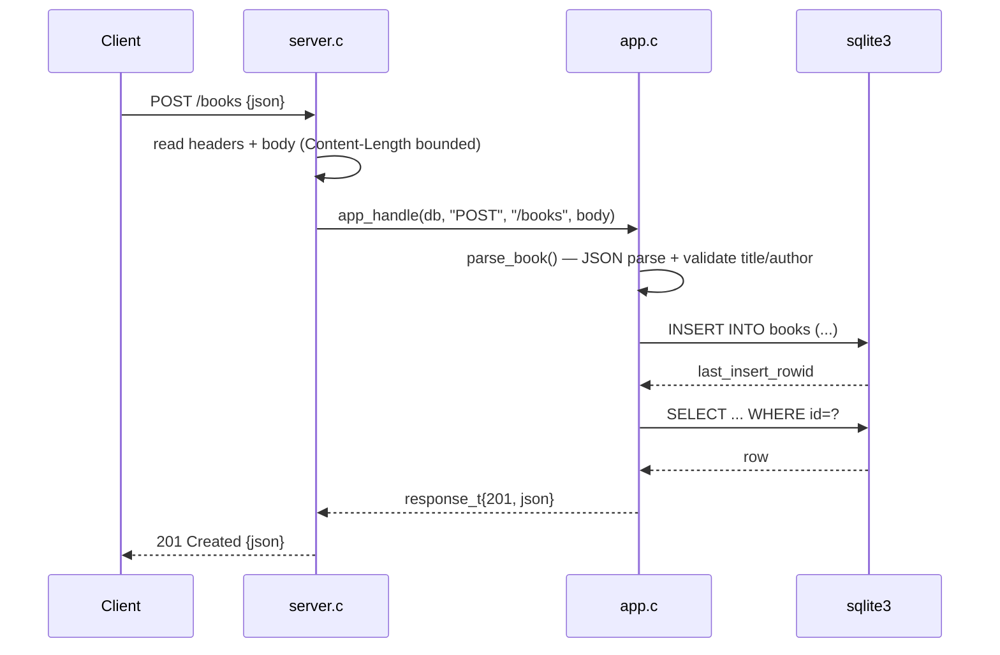

# Flow

A `POST /books` is read by the single-threaded server in `server.c`, which
bounds header (16 KB) and body (1 MB) sizes and rejects chunked
`Transfer-Encoding`. The body is handed to `app_handle`, which dispatches to
`create_book`. `parse_book` runs a hand-written recursive JSON parser
(handling escapes, `\u` surrogate pairs, and type checks), then enforces that
`title` and `author` are non-blank strings — returning 400 with a specific
message otherwise. Valid input is inserted via a parameterized statement
(no SQL interpolation), then re-read and serialized back as the 201 body.
Notable: no framework or JSON library is used — parser, serializer, HTTP
server, and router are all hand-rolled; SQL uses bound parameters throughout;
each request uses `Connection: close` (one request per connection).
