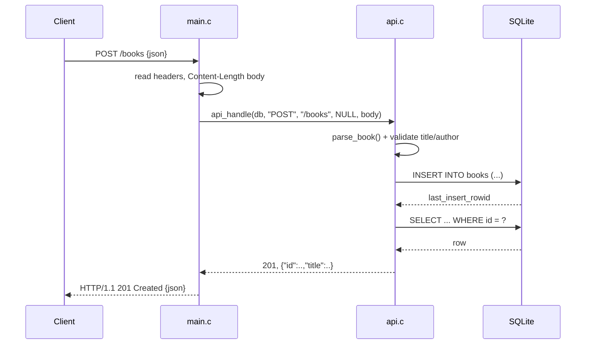

# Flow

A request to `POST /books` is read by `main.c:handle_client`, which splits the
request line and reads exactly `Content-Length` bytes of body. `api_handle`
routes on method+path to `save_book`, which parses the flat JSON object
(`parse_book`), rejects blank/missing `title` or `author` with 400, then binds
parameters into a prepared `INSERT` (no string interpolation — injection-safe).
The new row is re-read and serialized back as the 201 response body. The server
is single-threaded, one request per connection (`Connection: close`), with a
5-second socket timeout. Notable: hand-rolled JSON parser accepts flat objects
only (nested arrays/objects → 400) and a hand-rolled growable string buffer for
serialization; no external deps beyond libc and libsqlite3.
