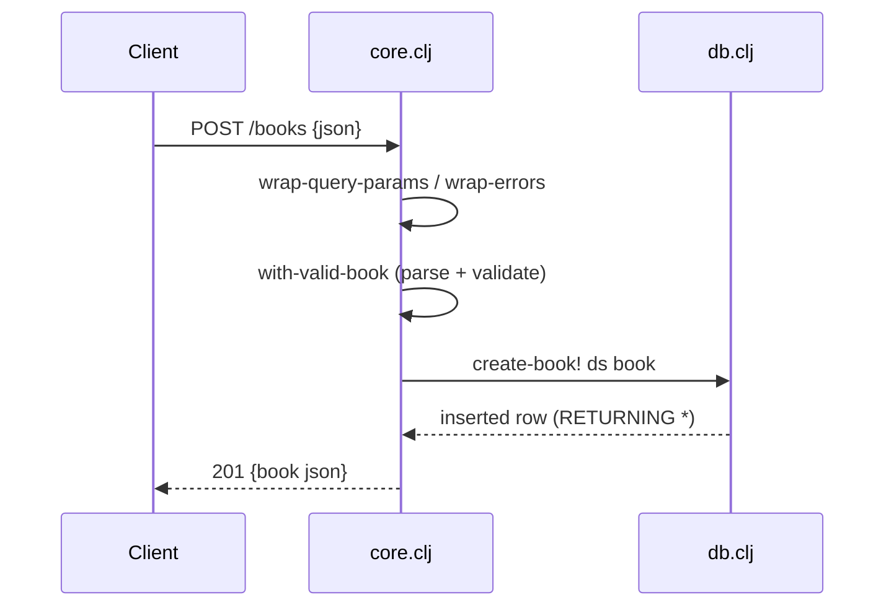

# Flow

A `POST /books` request passes through `wrap-errors` (catches unhandled
exceptions → 500) and `wrap-query-params` (parses only the query string, so the
body is read regardless of Content-Type). `with-valid-book` slurps the JSON
body, rejects a non-object body or a book missing a non-blank `title`/`author`
with a 400 carrying per-field `details`, then trims the strings and calls
`db/create-book!`, which inserts and returns the new row via SQLite `RETURNING *`.
The row is serialised to JSON and returned with 201. Errors are consistent JSON
(`400`/`404`/`500`); ids are validated with a `\d{1,18}` regex so malformed ids
yield 404 rather than a parse error.
