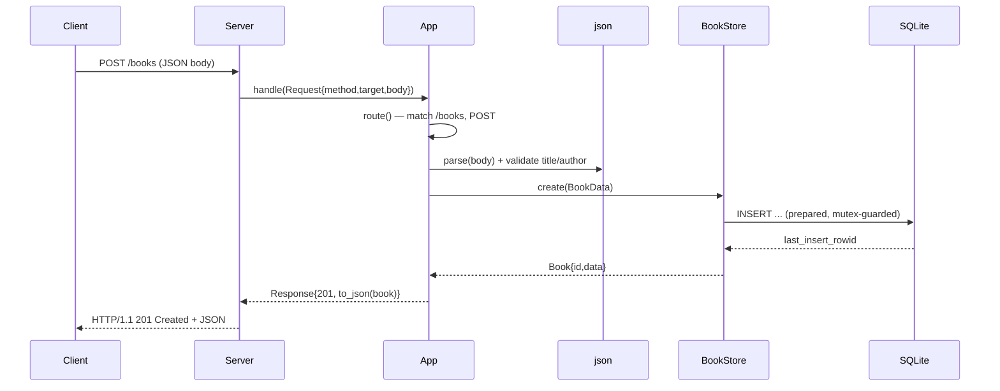

# Flow

A `POST /books` request is accepted by the thread-per-connection `Server`, which parses the request line/headers (rejecting malformed input with 400 and oversized bodies with 413) and calls `App::handle`. `route()` strips the query string, matches `/books`, and validates the JSON body via `parse_book`: the body must be a JSON object with non-empty string `title` and `author`; `year` must be an integer and `isbn` a string when present, otherwise 400. On success `BookStore::create` runs a mutex-guarded parameterized INSERT and returns the new `Book`, serialized to JSON with a 201. All handler paths are wrapped in a try/catch that converts any exception into a 500, so the transport layer never sees a throw.
