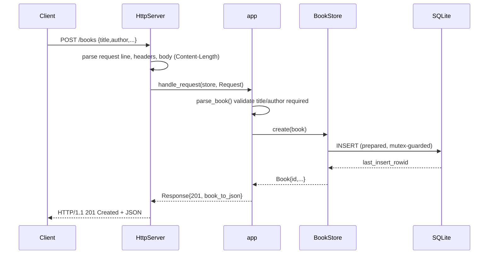

# Flow

A `POST /books` is read by the socket server (`http_server.cpp`), which splits the request line, honours `Content-Length` (rejecting oversized bodies with 413), and hands a `Request` to `handle_request`. `parse_book` requires non-blank string `title` and `author` and type-checks optional `year`/`isbn`, returning 400 on any violation. On success `BookStore::create` inserts via a mutex-guarded RAII prepared statement and returns the row with its new id, serialized back as JSON with a 201. Reads/updates/deletes follow the same path; `GET /books` optionally filters by a bound (injection-safe) `author` parameter. No pagination; PUT is full-resource replacement.
