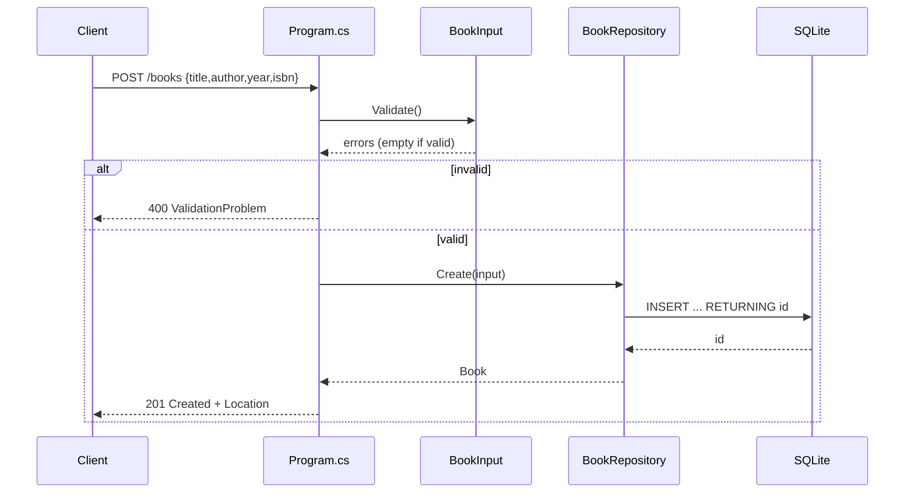

# Flow

A `POST /books` request is bound to `BookInput`, validated via `BookInput.Validate()` (title/author required, year range-checked). On failure the handler returns `400` with an RFC-7807 `errors` object. On success `BookRepository.Create` opens a fresh SQLite connection, inserts the row with parameterized SQL and `RETURNING id`, and the handler returns `201` with a `Location` header. The repository opens a connection per operation (no shared/pooled instance held); the DB schema is created idempotently in the constructor. Malformed request bodies are surfaced as `BadHttpRequestException` and converted to `400 {error}` JSON by the outer middleware.
