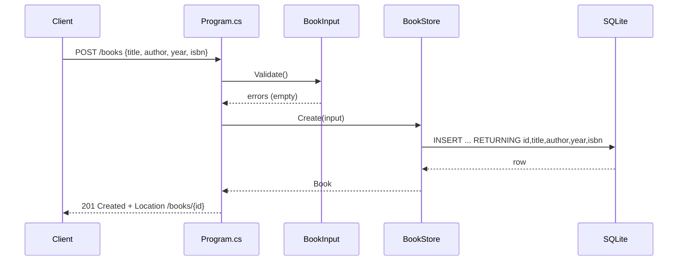

# Flow

A `POST /books` request binds the JSON body to `BookInput`, runs `Validate()` (title/author required, year in 0–9999). On validation failure it returns `400` via `Results.ValidationProblem`. Otherwise `BookStore.Create` opens a fresh pooled SQLite connection, executes a parameterized `INSERT ... RETURNING`, maps the returned row to a `Book`, and the handler returns `201 Created` with a `Location` header. Persistence is real SQLite (not in-memory state); each store method opens and disposes its own connection. Input is parameterized (no SQL injection); the `?author=` filter uses `COLLATE NOCASE`.
