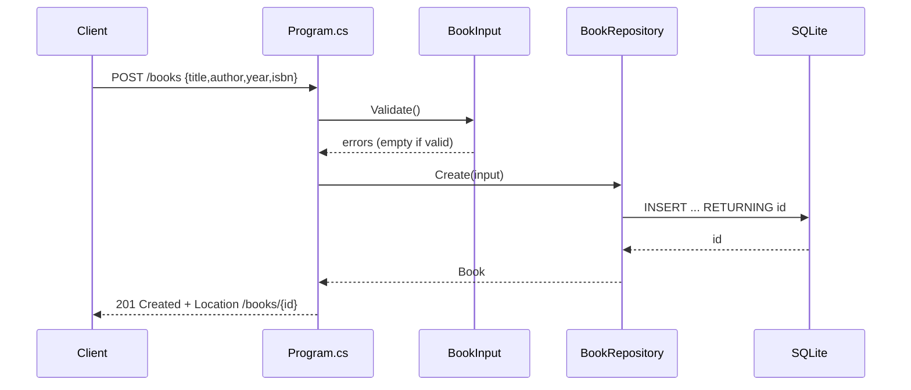

# Flow

A `POST /books` request is model-bound to `BookInput`, validated (title and author must be non-blank, year within 0–9999); validation failures short-circuit to `400` via `Results.ValidationProblem`. On success the repository opens a fresh `SqliteConnection`, inserts the row with parameterized SQL and `RETURNING id`, and the handler returns `201 Created` with a `Location` header. Each repository call opens and disposes its own connection (connection-per-operation); the schema is created idempotently in the repository constructor.
