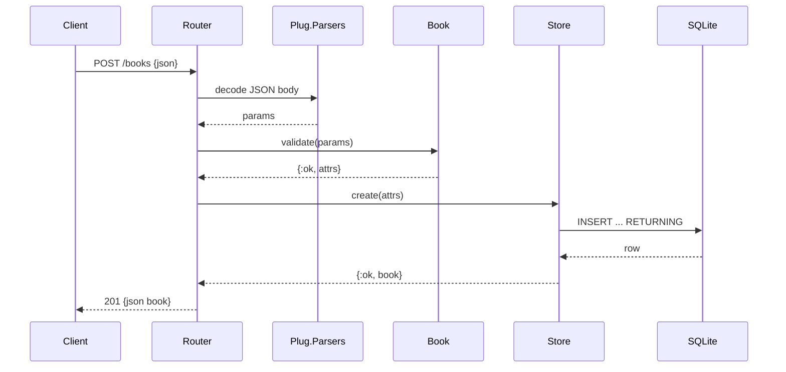

# Flow

A `POST /books` request is decoded by `Plug.Parsers` (JSON), then `BookApi.Book.validate/1`
checks that `title` and `author` are non-blank strings and that `year`/`isbn` have the
right types, trimming strings. On success the router calls `BookApi.Store.create/1`, which
issues a parameterised `INSERT ... RETURNING` against SQLite through the single
`BookApi.Store` GenServer that serialises all DB access on one connection. The inserted row
is returned to the client as JSON with status 201. Validation failures short-circuit via a
`with` chain to a 422 response carrying a per-field `details` map; malformed or non-object
bodies are caught by `Plug.ErrorHandler`/guards and yield 400.
