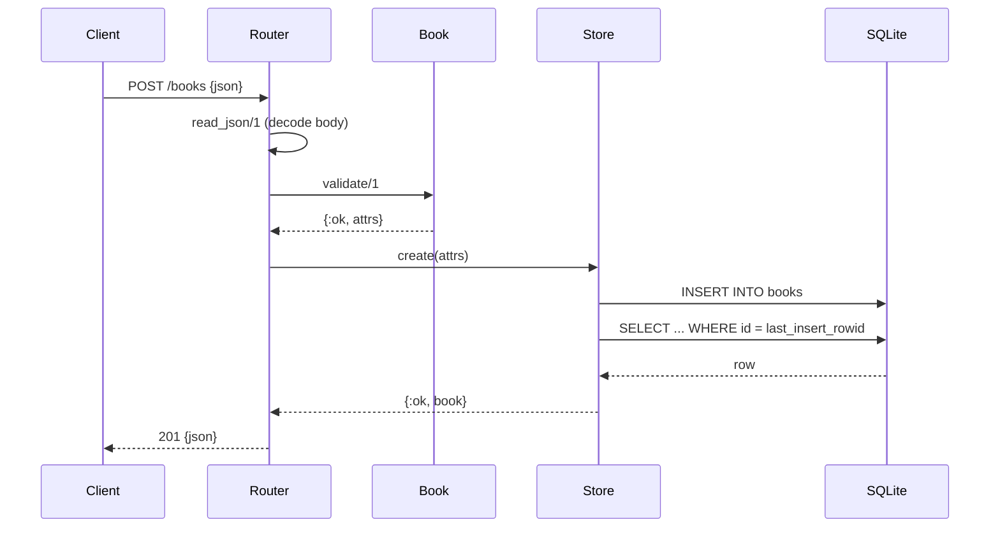

# Flow

A `POST /books` request is decoded by `read_json/1`, validated by `BookApi.Book.validate/1`
(title and author required non-blank strings; year integer and isbn string optional), then
handed to `BookApi.Store.create/1`. The Store is a single GenServer that owns the SQLite
connection and serializes all access, so writes are safe under concurrency without extra
locking. The inserted row is re-fetched and returned as JSON with 201. Errors short-circuit
the `with` chain and map to 400 (bad JSON), 422 (validation), 413 (oversized body), or 404.
