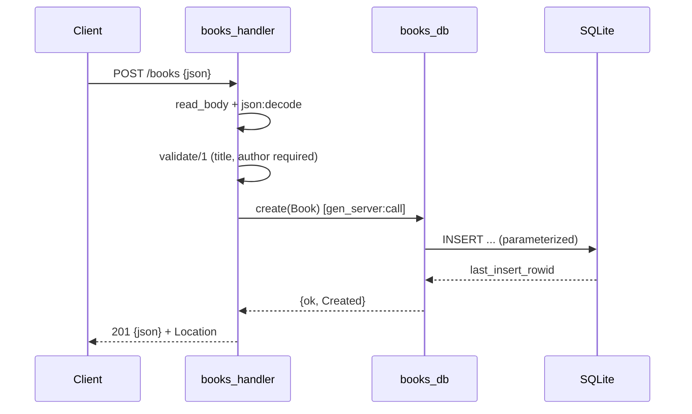

# Flow

A `POST /books` request is read up to a 1 MiB cap, JSON-decoded, then validated: `title` and `author` must be non-empty strings, `year`/`isbn` are optional and type-checked. On success the handler calls the `books_db` gen_server, which serializes a parameterized `INSERT` against SQLite and returns the persisted row (including the assigned id); the handler replies `201` with a JSON body and a `Location` header. Validation failures return `400` with a `details` list; malformed JSON returns `400`; all handler exceptions are caught and return `500`.
