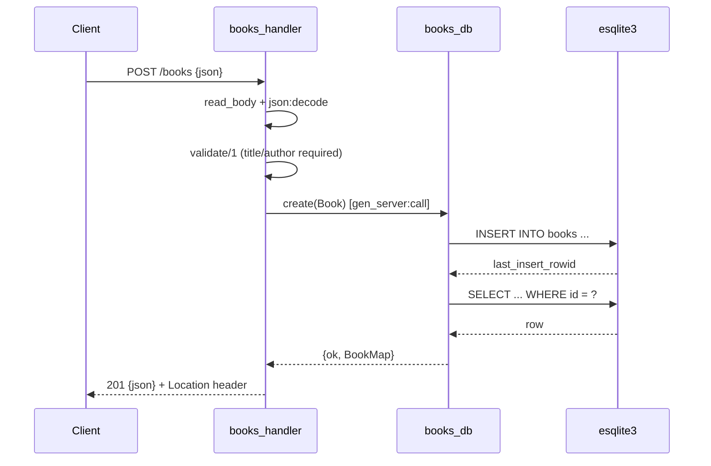

# Flow

A `POST /books` request is read fully (with a 1 MiB cap → 413), decoded with OTP's `json` module (bad JSON → 400), then validated by `books_handler:validate/1`: `title` and `author` must be non-empty strings (trimmed), `year`/`isbn` are optional and type-checked (violations → 422 with a per-field `details` map). On success the handler calls the `books_db` gen_server, which serialises the SQLite INSERT and re-fetches the row to return the persisted book with its generated id, and replies 201 with a `Location` header. All handler work is wrapped in a try/catch that logs and returns 500 on unexpected errors. DB access is single-threaded through one gen_server, so there is no connection pooling or concurrency within the store.
