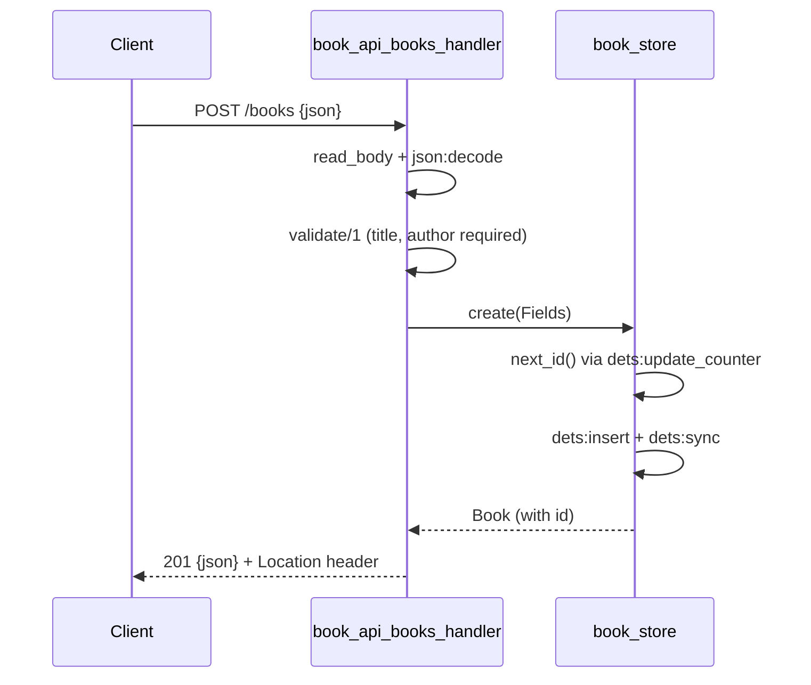

# Flow

A `POST /books` reads the body (capped at 1 MB), decodes it with the stdlib `json`
module, and runs `validate/1`: `title` and `author` must be non-blank strings, `year`
must be an integer if present, `isbn` a string if present. On failure it returns 422 with
a per-field `details` map; malformed/non-object JSON returns 400. On success the
`book_store` gen_server allocates a monotonic id via a `'$next_id'` DETS counter, inserts
and `dets:sync`s the row, and the handler replies 201 with the persisted book and a
`Location` header. All storage access is serialised through the single gen_server, so
there are no concurrent-write races. Note: validation rejections use 422 rather than the
400 named in the task's verification hint.
