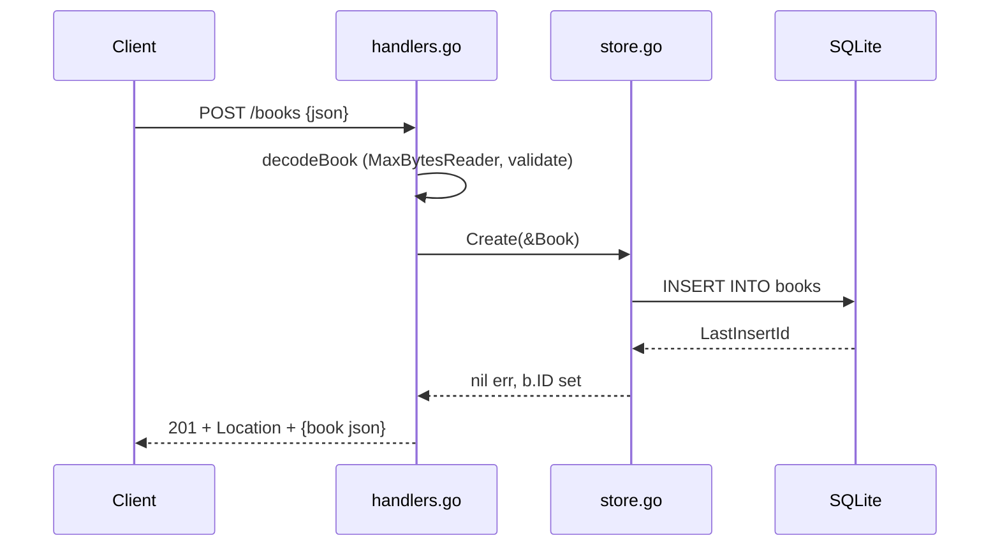

# Flow

A `POST /books` request is decoded by `decodeBook`, which caps the body at 1 MB,
rejects malformed/trailing JSON with 400, and enforces that `title` and `author`
are non-blank (and `year >= 0`) via `bookInput.validate()`. On success it calls
`Store.Create`, which inserts a row and back-fills the generated ID, then returns
201 with a `Location` header and the JSON book. Errors are uniformly JSON
(`errorBody`), with per-field detail for validation failures; not-found maps to
404, other store errors to a logged 500. Persistence is real SQLite, verified by
`TestPersistsAcrossReopen`.
