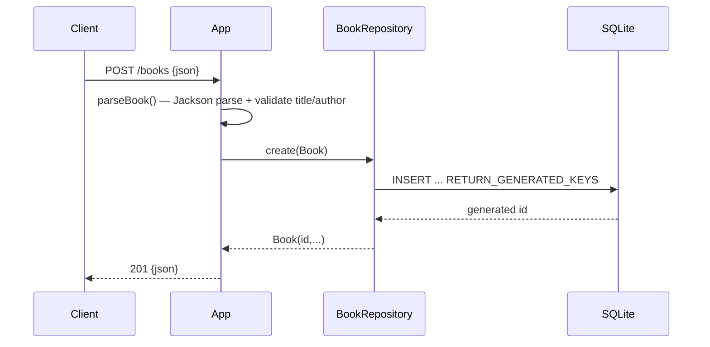

# Flow

A `POST /books` request is parsed and validated by `App.parseBook()`: the JSON body must be an object, `title` and `author` must be non-blank strings, and `year`/`isbn` are type-checked if present. Validation failures throw an `ApiException(400)` mapped to a JSON error with a `details` list. On success the `Book` is inserted via a synchronized `PreparedStatement` on a single shared SQLite connection, and the persisted book (with generated id) is returned as `201` JSON. Errors are handled centrally via Javalin exception mappers; a shared single connection with method-level synchronization serializes all DB access (which also keeps `:memory:` databases alive across requests).
